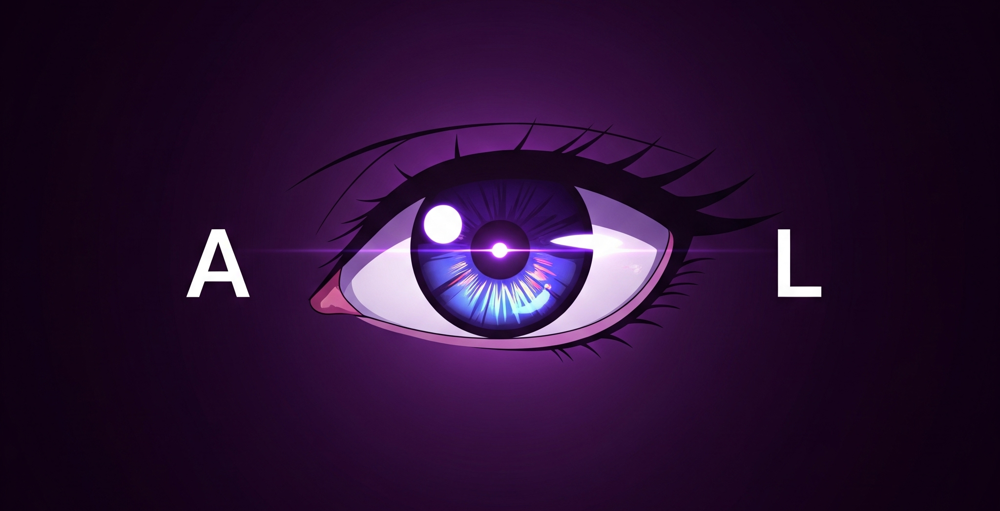

# 👁️ AnimeLens

[](LICENSE)
[](https://www.typescript.org/)
[](https://bun.sh/)
[](https://discord.js.org/)



A powerful Discord bot for anime and manga enthusiasts! Get instant information about your favorite anime, manga, characters, and more.

> **⚠️ Alpha Version**: This project was created in just a few hours and is currently in alpha. Expect frequent updates and improvements!

## 🚀 Installation

### Prerequisites

- [Bun](https://bun.sh/) (latest version recommended)
- A Discord bot token from [Discord Developer Portal](https://discord.com/developers/applications)

### Setup

1. **Clone the repository**
   ```bash
   git clone https://github.com/unloopedmido/animelens.git
   cd animelens
   ```

2. **Install dependencies**
   ```bash
   bun install
   ```

3. **Configure environment variables**

   Locale the `.env.example` file and rename it to `.env`. Then, fill in your Discord bot token and other configurations. Keep in mind some are optional for now.

4. **Build and run**
   ```bash
   # Development mode (with hot reload)
   bun run dev

   # Production mode
   bun run build
   bun run start
   ```

## 🏗️ Architecture

AnimeLens is built with a modular architecture to ensure scalability and maintainability:

- **Core Classes**: Located in `src/classes/`, these provide the foundation for commands, events, and client interactions.
- **Commands**: Organized in `src/commands/` by category (anime, manga, misc), each command extends the base `Command` class.
- **Events**: Handled in `src/events/`, managing Discord interactions and bot lifecycle.
- **Utilities**: Helper functions and loaders in `src/util/` for registration and embedding.
- **Types**: TypeScript definitions in `src/interfaces/` for API responses and data structures.

The bot uses the Jikan API (unofficial MyAnimeList API) for fetching anime and manga data, and AnimeThemes API for theme songs.

## 🛠️ Development

### Key Technologies

- **Bun**: Fast JavaScript runtime and package manager
- **TypeScript**: Type-safe JavaScript with modern features
- **Discord.js v14**: Powerful Discord API wrapper
- **@discordx/pagination**: Interactive pagination for Discord

## 🤝 Contributing

Contributions are welcome! This is an alpha project, so there are plenty of opportunities to improve:

- Add more anime/manga features
- Improve error handling
- Add more interactive elements
- Enhance the UI/embeds
- Add localization support
- Implement caching for better performance

### Development Workflow

1. Fork the repository
2. Create a feature branch: `git checkout -b feature/amazing-feature`
3. Make your changes and test thoroughly
4. Commit your changes: `git commit -m 'Add amazing feature'`
5. Push to the branch: `git push origin feature/amazing-feature`
6. Open a Pull Request

## ❓ FAQ

**Q: How do I get a Discord bot token?**  
A: Visit the [Discord Developer Portal](https://discord.com/developers/applications), create a new application, and generate a bot token under the "Bot" section.

**Q: The bot isn't responding to commands. What should I do?**  
A: Ensure the bot has the necessary permissions in your server and that the token is correctly set in the `.env` file. Check the console for any error messages.

**Q: Can I run this bot on my own server?**  
A: Yes! Follow the installation steps above. Note that you'll need to host it on a server that keeps the process running.

**Q: Is there a limit to API requests?**  
A: The bot uses the Jikan API & AnimeThemes API, which both have rate limits. In the future we will be implementing better caching and rate limit handling.

## 📄 License

This project is licensed under the MIT License - see the [LICENSE](LICENSE) file for details.

## 🙏 Acknowledgments

- **MyAnimeList** for providing the anime/manga database
- **Jikan API** for the excellent REST API
- **AnimeThemes API** for the theme song database
- **Discord.js** community for the amazing library
- **Bun** team for the fast runtime

## 📞 Support

- **GitHub Issues**: [Report bugs or request features](https://github.com/unloopedmido/animelens/issues)
- **Discord**: Join our community server (coming soon!)

---

**Made with ❤️ for anime fans, by anime fans**

*This project is not affiliated with MyAnimeList, AnimeThemes, Jikan, or any anime streaming services.*
